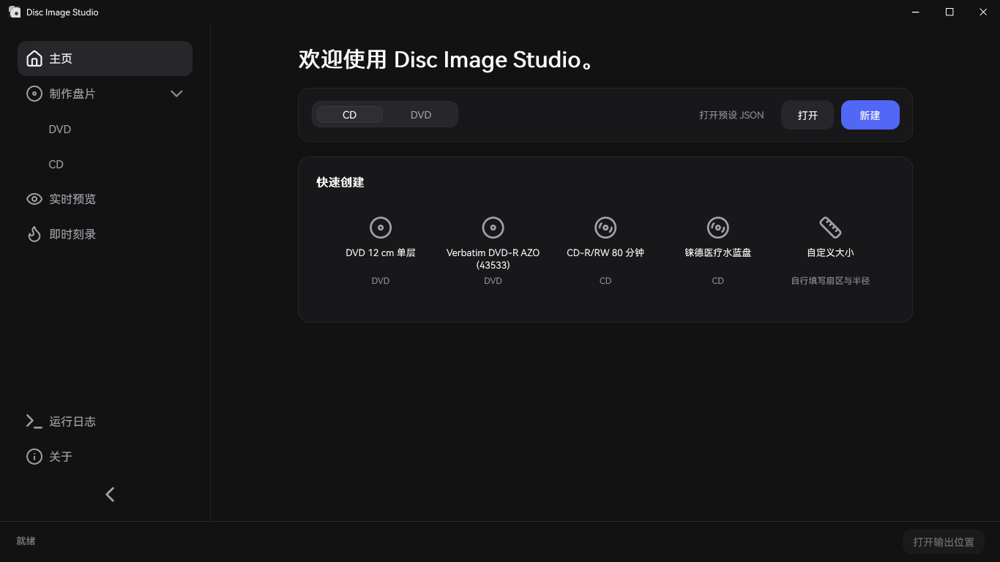
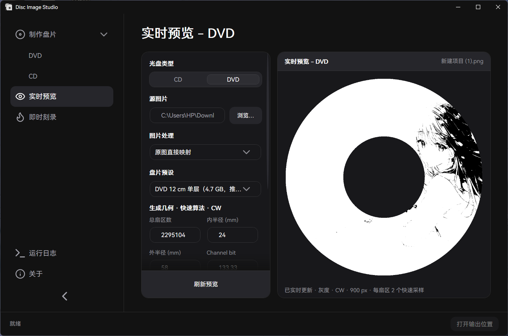
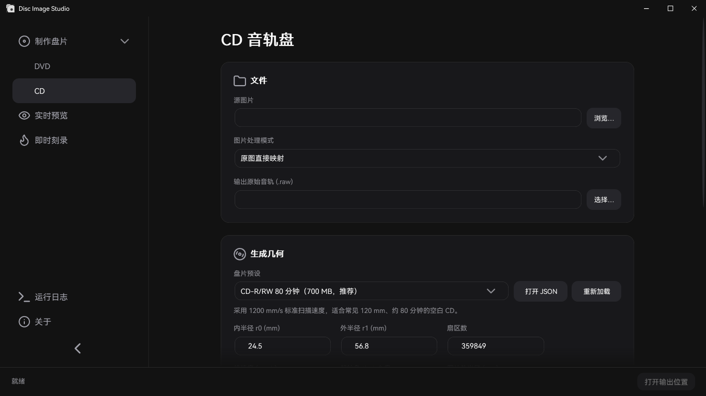
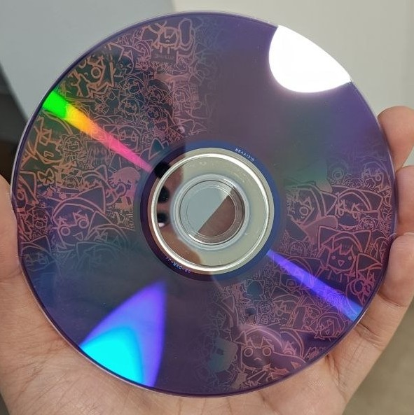
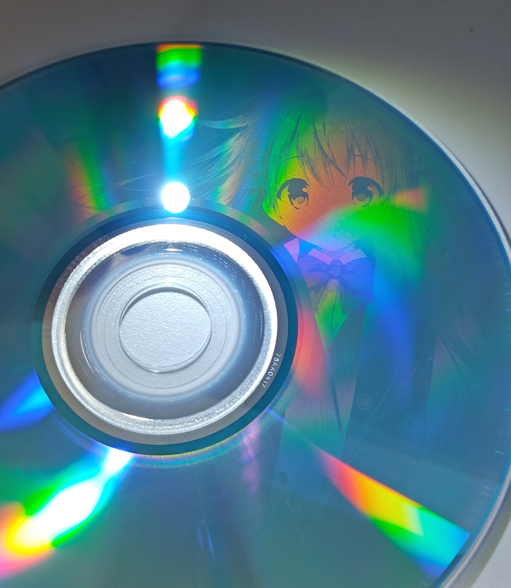

<div align="center">


<h2>全能的光盘盘面可见图像生成与刻录工具</h2>

Disc Image Studio 是一个运行在 Windows 的光盘盘面图像生成与刻录工具，帮助您在符合规格的 DVD / CD 光盘上刻蚀出肉眼可见的图像。


</div>

---

## 界面预览







---

## 效果预览





---

## 概述

Disc Image Studio 可将一张图片转换成符合 CD、DVD、蓝光（暂不支持）光盘物理层约束的数据，刻录后将使光盘盘面呈现肉眼可见的图案。

## 功能

### 光盘数据生成

- **CD-DA 支持**：推荐导出带格式头的 WAV 音轨及配套 CUE，兼容 cdrecord 与 ImgBurn；保留旧 RAW 音轨、延迟交织、固定 1200 mm/s 扫描速度（ECMA-130 范围下限）、CLV 几何与轨道预览。详见 [CD 刻录兼容说明](docs/CD_AUDIO_COMPATIBILITY.md)。
- **DVD 支持**：固定的快速纹理（dispersion）算法、快速输出、顺时针（CW）螺旋，支持 ISO 纯绘图盘与"内圈文件、外圈绘图"的混合数据盘。
- **盘片预设**：内置 JSON + 用户层 JSON 分层配置，首次启动生成可编辑的自定义预设，同 ID 用户项可覆盖内置参数，内置修正随应用自动更新；预设只含容量与生成几何，详见[预设维护说明](docs/DISC_PRESETS.md)。
- **实时预览**：输入开关有两种模式，默认“输入原图”（标定预览）用源图片与生成/实测两套几何做投影，只读图片不读产物，性能较高；“输入镜像”（读回模拟）读取生成产物（CD 音轨 / DVD ISO），按实测几何还原镜像里真实写下的图案。两种模式共用一套盘片几何参数与导出动作，详见 [DVD 引擎说明](docs/DVD_ENGINE.md) 与 [CD 刻录兼容说明](docs/CD_AUDIO_COMPATIBILITY.md)。

### 刻录

- **镜像文件输出**：您可以导出完整 ISO / RAW 文件并使用合适的刻录软件手动刻录。
- **即时流式刻录（实验性）**：CD、纯绘图 DVD 与混合 DVD 边生成边刻录，使用 64 MiB 有界内存缓冲（开刻前预填充 32 MiB），不保存完整镜像；混合模式先计算 ISO9660/Joliet 布局，再严格按 LBA 顺序输出。
- **拒绝非空白介质！**

### 应用形态

- 双入口：不带参数将打开 GUI；带参数则进入统一命令行。
- 启动后选定光盘类型后可直接新建或打开源图片，也可以按盘片预设快速创建，并回访最近生成的任务。
- 模块化：CD 与 DVD 通过 `IOpticalDiscModule` 接入；蓝光暂未实现。

## 系统要求

- Windows 10 2004（2004/20H1，19041）及以上，或 Windows 11。
- 构建：.NET 9 SDK（`global.json` 锁定 9.0.x）；自行构建的非自包含 GUI 需要 .NET 9 Windows 桌面运行时。Release EXE 已包含运行时，无需另行安装 .NET。
- “即时刻录”功能需要一台 Windows 可识别的 CD / DVD 刻录机与空白盘片。

## 下载与发布

已公开的正式版与预发布版见 [GitHub Releases](https://github.com/JiaFeiMiao-K-Cat/DiscImageStudio/releases)。Windows x64 单文件程序命名为 `DiscImageStudio-v<版本>-win-x64.exe`，下载后直接运行；Release 说明中提供 SHA-256 校验值。预发布版用于测试，请留意版本说明。

版本规则、GitHub Actions 自动生成 EXE、Release 草稿检查与 MSIX 打包方式见[发布指南](docs/RELEASING.md)。

## 构建与运行

```powershell
dotnet build DiscImageStudio.slnx --configuration Release
dotnet run --project src/DiscImageStudio.App --configuration Release
```

构建回归检查：

```powershell
dotnet run --project src/DvdImageSolver --configuration Release -- selftest
dotnet run --project tests/DiscImageStudio.ArchitectureTests --configuration Release
```

MSIX 打包、测试包签名与发布流程见[发布指南](docs/RELEASING.md)。

## 命令行

统一程序不带参数时将打开 GUI，而带参数时作为自动化工具使用：

| 命令 | 说明 |
| --- | --- |
| `solve` | 使用固定快速纹理映射（CW 方向）生成 DVD 镜像 |
| `encode` | 将单个 DVD ECC 块编码为 NRZI 通道电平 |
| `calibrate` | 标定投影：按生成几何从 DVD 源图片取样，按实测几何投到盘面 |
| `simulate` | 按实测半径对生成的 DVD ISO 做读回模拟 |
| `selftest` | 运行 DVD 引擎的确定性回归自检 |
| `cd-generate` | 将图片映射为 WAV + CUE 或旧 RAW CD-DA 音轨，可选延迟交织 |
| `cd-preview-warp` | 标定投影：按生成几何从 CD 源图片取样，按实测几何投到盘面（`--actual-r0` / `--actual-r1`） |
| `cd-preview-track` | 按标定几何渲染已有的 WAV 或 RAW CD-DA 音轨（读回模拟，默认逆交织） |

完整 DVD 引擎说明见 [DVD_ENGINE.md](docs/DVD_ENGINE.md)。

## 源码结构

```text
src/DiscImageStudio.Core/    介质无关的模块契约、元数据、任务与命令目录
src/DiscImageStudio.Imaging/ CD/DVD/未来蓝光可复用的图片预处理层
src/DiscImageStudio.Burning/ Windows IMAPI2 设备枚举、流缓冲与安全刻录层
src/DiscImageStudio.Cd/      CD-DA 生成核心与 CD 模块
src/DiscImageStudio.Dvd/     DVD 引擎适配模块
src/DiscImageStudio.App/     WPF GUI、统一命令行与商店资源
src/DvdImageSolver/          保持隔离的 DVD 编码/求解引擎
tests/                       无第三方测试框架的架构回归测试
packaging/                   MSIX 清单与打包脚本
tools/                       资产生成与 EFM 表生成的辅助脚本
docs/                        架构、引擎、预设、发布等文档
```

## 文档

| 文档 | 内容 |
| --- | --- |
| [架构说明](docs/ARCHITECTURE.md) | 模块抽象、层间边界与扩展规则 |
| [DVD_ENGINE.md](docs/DVD_ENGINE.md) | DVD NRZI 图像约束求解器的约定、编码链与自检覆盖 |
| [DISC_PRESETS.md](docs/DISC_PRESETS.md) | 可编辑盘片预设的分层 JSON 格式与合并规则 |
| [ADDING_BLURAY.md](docs/ADDING_BLURAY.md) | 在不改动 CD/DVD 的前提下接入蓝光模块的步骤 |
| [VALIDATION.md](docs/VALIDATION.md) | 各轮构建、回归与实盘测试的本地验证记录 |
| [RELEASING.md](docs/RELEASING.md) | GitHub Release、MSIX 打包、签名测试与商店提交流程 |
| [CHANGELOG.md](CHANGELOG.md) | 版本变更记录 |

## 刻录与介质安全须知

- Disc Image Studio 不安装驱动或服务；“即时刻录”功能使用了 Windows 自带的 IMAPI2，拒绝非空白介质。
- “即时刻录”功能已有部分实盘反馈，对不同设备、介质与刻录入口的验证覆盖仍有限，属于实验性功能，请只使用可报废的测试介质。刻录中断、断电或生成速度不足仍可能使盘片报废。
- 实际可见效果取决于盘片、刻录机、固件与写入策略。
- DVD 混合文件夹会在开始刻录前扫描目录并固定布局；期间源文件大小改变会安全终止任务，但已开始写入的盘片仍可能报废。

## 隐私与安全

- Disc Image Studio 不联网、不上传文件、不收集遥测，详见[隐私政策](PRIVACY.md)。
- 发现安全问题请不要在公开 Issue 中披露，按[安全政策](SECURITY.md)使用 GitHub 私密报告。

## 贡献

欢迎报告问题与提交代码。开发环境搭建、模块边界规则、测试要求与 Pull Request 流程见[贡献指南](CONTRIBUTING.md)。

## 许可证

仓库尚未选择开源许可证：在补上明确的 `LICENSE` 文件之前，公开可见不等于授权复制、修改或再发布。该决定需由项目所有者做出，详见 [LICENSE-NOTICE.md](LICENSE-NOTICE.md)。

---

## Star History

<a href="https://www.star-history.com/?repos=jiafeimiao-k-cat%2Fdiscimagestudio&type=date&legend=top-left">
 <picture>
   <source media="(prefers-color-scheme: dark)" srcset="https://api.star-history.com/chart?repos=jiafeimiao-k-cat/discimagestudio&type=date&theme=dark&legend=top-left" />
   <source media="(prefers-color-scheme: light)" srcset="https://api.star-history.com/chart?repos=jiafeimiao-k-cat/discimagestudio&type=date&legend=top-left" />
   
 </picture>
</a>
