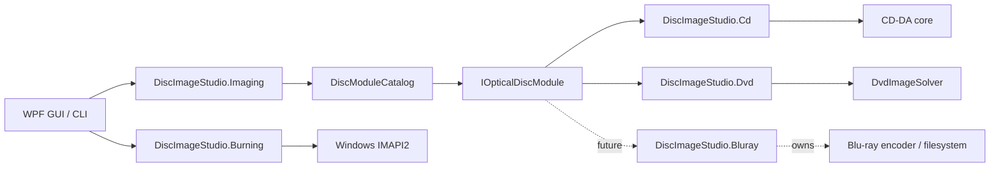

# 架构说明

## 目标

核心目标是让应用外壳不依赖某一种光盘编码。CD、DVD、蓝光的物理调制、纠错、扇区组织和文件系统不同，因此共享的是任务生命周期和产品能力，不共享错误的“万能编码器”基类。

## Core 契约

`DiscImageStudio.Core` 不引用 WPF、CD、DVD 或任何具体编码器，并以 `net9.0` 为目标。

- `IOpticalDiscModule`：模块执行边界。
- `DiscModuleDescriptor`：模块 ID、介质家族、取消能力和命令元数据。
- `DiscCommandDescriptor`：命令、能力和选项定义，可供未来动态生成界面。
- `DiscJobRequest`：统一命令与参数载体。
- `DiscJobProgress`：介质无关的进度、阶段、完成量和耗时。
- `DiscJobResult`：退出码、摘要和输出路径。
- `DiscModuleCatalog`：命令路由、重复命令检查和模块执行。

`OpticalDiscFamily` 已包含 `BluRay`，但这只代表扩展位已预留，不表示当前版本已经实现蓝光编码。

盘片预设由各介质模块自行定义：`DiscImageStudio.Cd` 提供 CD 预设，`DiscImageStudio.Dvd` 提供 DVD 预设，界面只负责选择、同步和切换自定义状态。未来蓝光模块可以增加自己的预设目录，无需修改 CD/DVD 参数模型。

## 图片预处理层

`DiscImageStudio.Imaging` 位于界面与介质编码模块之间。当前提供环形复制布局：根据源图宽高比和可用圆周自动计算份数，将同一张图复制多份并使顶部朝向光盘外侧；每份图像使用同一缩放比例，并同时受内圈、外圈和相邻扇区边界约束，放不下时自动等比缩小，从几何上避免变形、裁切与重叠。它输出普通方形 PNG，因此 CD、DVD 以及未来蓝光模块都能复用，而不需要互相引用介质专用实现。

## 流式刻录层

`DiscImageStudio.Burning` 只负责 Windows IMAPI2 设备枚举、介质检查、COM `IStream` 适配、约 16 MiB 有界内存缓冲和刻录生命周期。CD/DVD 生成器仍拥有介质格式：CD 顺序产生 2352 字节音频扇区，DVD 快速算法顺序产生 2048 字节数据扇区。刻录器按需读取这些块，因此磁盘上不出现完整镜像。原文件输出入口不经过该层，失败时不会破坏原工作流。

DVD 混合文件夹模式需要在不同 LBA 随机写入文件系统结构，当前不允许直接流式刻录；用户必须先生成 ISO。未来蓝光可实现自己的顺序生成器后复用同一刻录契约。

## 模块边界

### CD

`DiscImageStudio.Cd` 拥有 CD 几何、图片采样、RAW 输出和延迟交织。它实现取消，并把字节进度转换成统一的 `DiscJobProgress`。

### DVD

`DiscImageStudio.Dvd` 是薄适配器。它只负责元数据、路由与结果归一化，然后调用隔离的 `DvdImageSolver`。DVD 引擎原参数和自检保持不变。

### Blu-ray

未来模块应拥有自己的扇区组织、纠错、调制、容量配置和文件系统写入代码。它只通过 Core 契约向 GUI 暴露任务，不应引用或修改 CD/DVD 内部类型。

## 扩展规则

1. 模块 ID 和命令名必须全局唯一，目录会在启动时拒绝冲突。
2. 模块不得从 GUI 控件读取状态；输入全部来自 `DiscJobRequest`。
3. 模块不得直接显示窗口；日志、进度和结果通过契约返回。
4. 如果底层算法不能安全取消，`SupportsCancellation` 必须为 `false`。
5. 介质专用格式留在专用模块；只有稳定且真正共享的概念进入 Core。
6. 新模块必须增加目录路由测试和一个最小输出冒烟测试。
